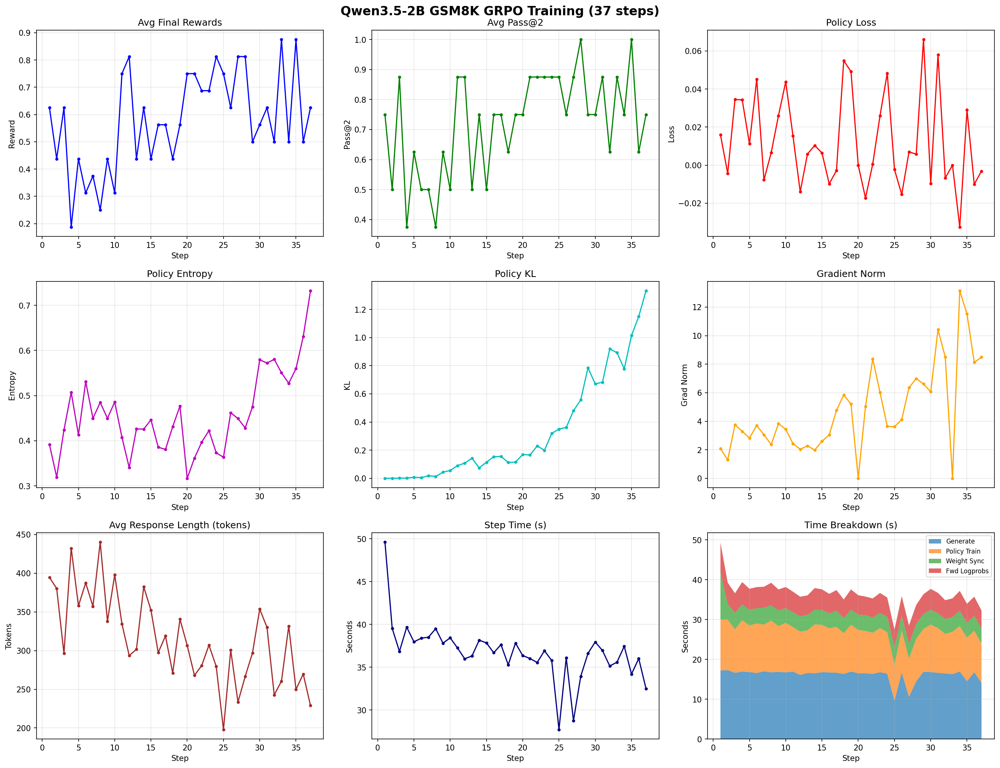

# Running GSM8K with Qwen3.5 on SkyRL

## Status

**Working**: Model loading, vLLM inference/generation, weight sync, training forward pass, training backward pass.

**Known limitations**: The pure Python `torch_chunk_gated_delta_rule` (Qwen3.5 linear attention) is very slow during training. A fused kernel (e.g., from the `fla` library) is needed for practical training speeds.

## Quick Start

```bash
# 1. Install dependencies (from repo root)
uv sync --extra fsdp

# 2. Prepare dataset
uv run examples/train/gsm8k/gsm8k_dataset.py --output_dir $HOME/data/gsm8k

# 3. Run training (Qwen3.5-2B on 4 GPUs)
NUM_GPUS=4 bash examples/train/gsm8k/run_gsm8k_qwen3_5.sh \
  trainer.policy.model.path="Qwen/Qwen3.5-2B"
```

## Required Changes from Upstream SkyRL

### 1. `pyproject.toml` - Version Bumps

| Package | Before | After | Reason |
|---------|--------|-------|--------|
| vllm | 0.16.0 | 0.17.0 | Native Qwen3.5 model support |
| torch | 2.9.1 | 2.10.0 | Required by vllm 0.17.0 |
| transformers | >=4.56.1,<5 | >=5.3.0 | Native `qwen3_5` model type for FSDP |
| flashinfer-python | 0.6.3 | 0.6.4 | Required by vllm 0.17.0 |
| flashinfer-jit-cache | 0.6.3 | 0.6.4 | Matches flashinfer-python |
| accelerate | (unpinned) | >=1.13.0 | Fixes `_is_hf_initialized` TypeError with transformers 5.x |

### 2. flash-attn Pre-built Wheel

flash-attn 2.8.3 has NO pre-built wheel for torch 2.10.0 on PyPI or official GitHub releases.
Use community pre-built wheel from [mjun0812/flash-attention-prebuild-wheels](https://github.com/mjun0812/flash-attention-prebuild-wheels):

```toml
# In [tool.uv.sources]:
flash-attn = { url = "https://github.com/mjun0812/flash-attention-prebuild-wheels/releases/download/v0.7.16/flash_attn-2.8.3+cu128torch2.10-cp312-cp312-linux_x86_64.whl", marker = "sys_platform == 'linux'" }
```

### 3. Override Dependencies

vllm 0.17.0 caps `transformers<5`, but FSDP training needs `>=5.3.0` for native Qwen3.5:

```toml
# In override-dependencies:
"transformers>=5.3.0",
```

Also update megatron-bridge to commit `0034ddaa` (supports transformers 5.x).

### 4. transformers 5.x `return_dict=False`

transformers 5.x changed `apply_chat_template(tokenize=True)` to return `BatchEncoding` instead of `list[int]`. Add `return_dict=False` to all call sites in:
- `skyrl/train/generators/skyrl_gym_generator.py`
- `skyrl/train/generators/utils.py`
- `skyrl/train/dataset/dataset.py`
- `skyrl/backends/skyrl_train/inference_engines/inference_engine_client.py`
- `examples/train/mini_swe_agent/mini_swe_generator.py`

### 5. `vllm_worker.py` - Weight Sync Layer Naming

Qwen3.5 uses `ForConditionalGeneration` in vLLM (VL wrapper) but `ForCausalLM` in FSDP training. Weight names differ by `language_model.` prefix:

```python
model_cls = type(self.model_runner.model).__name__
needs_lm_prefix = "ForConditionalGeneration" in model_cls
for name, tensor in self._weight_receiver.receive_weights(request):
    if needs_lm_prefix and not (name.startswith("language_model.") or name.startswith("visual.")):
        name = f"language_model.{name}"
```

### 6. Qwen3.5 Monkey-Patches (in `model_wrapper.py`)

**Patch 1: 3D position_ids fix** (from [prime-rl](https://github.com/PrimeIntellect-ai/prime-rl/commit/2767dea))
Qwen3.5 passes 3D MRoPE position_ids to decoder layers, breaking flash attention:

```python
if position_ids is not None and position_ids.ndim == 3:
    position_ids = position_ids[0]
```

Upstream fix: huggingface/transformers#44399

**Patch 2: CPU tensor creation in `chunk_gated_delta_rule`**

Qwen3.5's hybrid architecture uses **Gated Delta Rule** linear attention layers (`Qwen3_5GatedDeltaNet`)
alongside standard full-attention layers. The linear attention is implemented by two pure-Python
reference functions in transformers 5.3.0:

- `torch_chunk_gated_delta_rule()` — chunked version (used during training)
- `torch_recurrent_gated_delta_rule()` — token-by-token version (used during generation)

Both have a bug on the `initial_state` tensor creation (3 occurrences total at L376, L420, L422):

```python
# Original (transformers 5.3.0, modeling_qwen3_5.py L376):
last_recurrent_state = (
    torch.zeros(batch_size, num_heads, k_head_dim, v_head_dim).to(value)  # BUG
    if initial_state is None
    else initial_state.to(value)
)
```

**What happens:**
1. `torch.zeros(...)` creates a tensor on **CPU** (default device)
2. `.to(value)` copies it to the GPU where `value` lives

**Why it fails during training:**
SkyRL uses `torch.utils.checkpoint` (gradient checkpointing) to reduce memory usage during
FSDP training. During the backward pass, the checkpointing mechanism:
1. Frees activations saved during the forward pass
2. Re-runs the forward pass to recompute them
3. During this recomputation, CUDA memory has been freed and reallocated

The `.to(value)` call during recomputation encounters a CUDA context where the source CPU tensor
allocation interacts with a modified GPU memory layout, triggering:
```
torch.AcceleratorError: CUDA error: an illegal memory access was encountered
Search for `cudaErrorIllegalAddress'
```

The error trace always points to `modeling_qwen3_5.py L376` (`torch_chunk_gated_delta_rule`)
inside the backward pass recomputation:
```
torch/utils/checkpoint.py:1173, in unpack_hook
  _run_fn_with_dynamo_disabled(frame.recompute_fn, *args)
  ...
  modeling_qwen3_5.py:376, in torch_chunk_gated_delta_rule
    torch.zeros(batch_size, num_heads, k_head_dim, v_head_dim).to(value)
```

**The fix** (in `model_wrapper.py`) wraps `torch_chunk_gated_delta_rule` to pre-create
`initial_state` on the correct device before the function is called:

```python
@functools.wraps(orig_fn)
def _patched_delta_rule(*args, **kwargs):
    sig = inspect.signature(orig_fn)
    bound = sig.bind(*args, **kwargs)
    bound.apply_defaults()
    if bound.arguments.get("initial_state") is None:
        key = bound.arguments["key"]    # shape: (batch, seq_len, num_heads, k_head_dim)
        value = bound.arguments["value"]  # shape: (batch, seq_len, num_heads, v_head_dim)
        # Create directly on GPU — key is pre-transpose so dims are [0]=batch, [2]=heads, [3]=head_dim
        b, num_heads, kd, vd = key.shape[0], key.shape[2], key.shape[3], value.shape[3]
        bound.arguments["initial_state"] = torch.zeros(
            b, num_heads, kd, vd, device=value.device, dtype=value.dtype
        )
    return orig_fn(*bound.args, **bound.kwargs)
```

Note the shape subtlety: the function receives tensors in `(batch, seq_len, num_heads, head_dim)`
layout, then transposes them internally to `(batch, num_heads, seq_len, head_dim)` at L339-340.
The wrapper must use the pre-transpose shapes (`key.shape[2]` for num_heads, `key.shape[3]` for k_head_dim).

**Alternative**: SLIME avoids this entirely by using the `fla` library's fused Triton kernels
(`fla.ops.gated_delta_rule.chunk_gated_delta_rule`) instead of transformers' Python reference
implementation. prime-rl does not have this patch and may not have encountered it (possibly
they don't use gradient checkpointing on linear attention layers, or their transformers pin
doesn't trigger this path).

**Note on performance**: The pure-Python `torch_chunk_gated_delta_rule` is a nested for-loop
over chunks and is extremely slow (~10x slower than the fused `fla` kernel). For practical
training, integrating the `fla` library's CUDA/Triton kernels is recommended.

### 7. Training Script Key Config

```bash
trainer.policy.model.path="Qwen/Qwen3.5-2B"
trainer.policy.fsdp_config.wrap_policy.transformer_layer_cls_to_wrap="['Qwen3_5DecoderLayer']"
trainer.ref.fsdp_config.wrap_policy.transformer_layer_cls_to_wrap="['Qwen3_5DecoderLayer']"
generator.inference_engine.engine_init_kwargs.language_model_only=true
```

## Training Results

### Qwen3.5-2B GSM8K GRPO (37 steps, 1x H100, batch_size=8)



**Key observations:**
- **Rewards**: Fluctuating 0.2-0.9 (small batch, high variance), avg ~0.45
- **Pass@2**: Generally 0.6-0.9
- **Policy KL**: Steadily increasing (expected with GRPO)
- **Grad Norm**: Growing - training is active
- **Step Time**: ~35s/step (generation ~16s, policy train ~10s, weight sync ~4s)
- **Response Length**: 280-480 tokens

### Wandb Runs
- **Qwen3.5-2B** (16 steps): https://wandb.ai/sky-posttraining-uc-berkeley/gsm8k-qwen3.5/runs/krvj0f5s
- **Qwen3.5-0.8B** (ongoing): https://wandb.ai/sky-posttraining-uc-berkeley/gsm8k-qwen3.5/runs/lr53x6z9

## References

- [SkyRL Issue #1254](https://github.com/NovaSky-AI/SkyRL/issues/1254) - Qwen3.5 support tracking
- [prime-rl commit 2767dea](https://github.com/PrimeIntellect-ai/prime-rl/commit/2767dea) - Qwen3.5 patches, flash-attn wheel
- [prime-rl PR #1980](https://github.com/PrimeIntellect-ai/prime-rl/pull/1980) - vllm 0.17.0 official release
- Frontier-CS-Evolve/SkyRL branch `runnable-for-non-qmang` - weight sync layer naming fix
