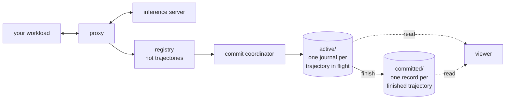
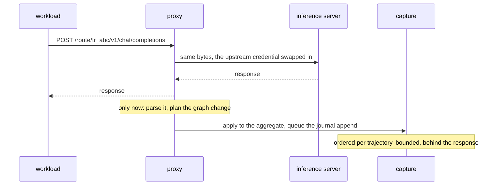
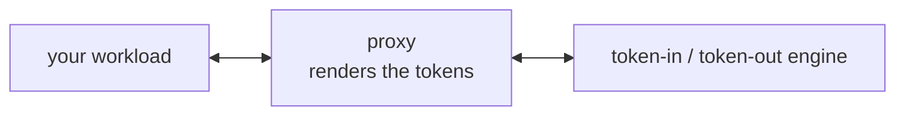
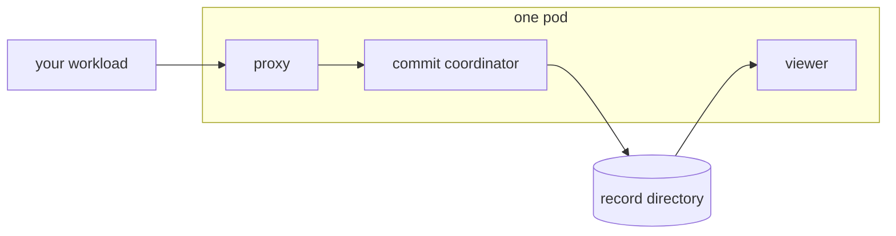
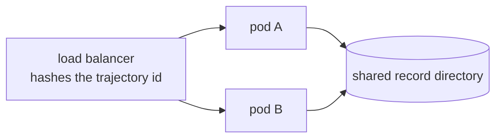

# Architecture

SkyRL Capture sits between your workload and an inference server. It
forwards every model call unchanged and records what it saw.

Three things shape the design:

1. **Your workload does not change.** A trajectory is a URL, not a header and
   not an SDK patch.
2. **Capture never slows down or fails an inference.** If recording cannot keep
   up, recording is what degrades.
3. **What is captured becomes trainable** — a timeline, a context graph, labels
   and rewards, and deterministic exports.
4. **Every trajectory is persisted as it runs.** There is no mode in which one
   is not; a process with nowhere to write refuses to start.

## The shape of it



## The components

| Component | What it does |
| --- | --- |
| **Proxy** | Forwards the call, then derives the exchange and the graph change it made. The only thing on the request path. One of two implementations, chosen at startup |
| **Registry** | The trajectories this process is hot for. One aggregate each, recovered from its journal when a request for a cold one arrives -- unless a committed record exists, which ends the trajectory whatever is still on disk beside it |
| **Commit coordinator** | Bounded background persistence, ordered per trajectory |
| **Active journal** | One append-only file per trajectory in flight. What a replacement process picks up |
| **Committed record** | One compiled, viewer-ready file per finished trajectory. Written once, atomically |
| **Viewer** | The read API and bulk exports, over those files. Enabled by default, removable with `--disable-viewer` |

**There is no global log and no global state.** A trajectory is its own
aggregate, its own file, and its own writer. Nothing coordinates a sequence
across trajectories, which is what lets several capture processes share one
directory: they compute the same path for the same trajectory, and routing
guarantees only one of them is writing it.

**project / run / trajectory.** A project groups work over time; a run is one
execution inside it; a trajectory is one attempt inside that run, naming the
task it attempted and the training step that produced it. `run_id`, `task_id`
and `step` are fields on a trajectory rather than annotations, because every
question an RL run is read with groups by them -- one task across steps, one
step across tasks, the reward surface over both.

A control plane (`/v1`) creates and finishes trajectories, reads what was
captured, and runs exports. It is not on the request path, and it is
unauthenticated: the upstream this process captures is chosen when it starts,
so there is nothing to administer over HTTP.

## One request



The reply goes back before anything is recorded. On the way out the proxy reads
four clocks and appends already-available byte objects to a list; everything
else happens after the last byte has reached your workload. It never parses
your payloads, matches prefixes, or waits on a disk before replying.

The exchange is applied to the trajectory's own aggregate **synchronously**, so
the next turn matches against a graph that already contains this one, and the
append is queued. The queue is bounded; when it is full the work is refused
rather than the request path being made to wait, and the refusal is recorded as
a gap the trajectory carries from then on.

Once the append is durable the raw bodies and token arrays leave memory. A long
trajectory is bounded by its graph, not by everything it ever sent.

### The route is the trajectory

`create_trajectory` returns a fresh URL. You point your workload at it and run
the workload unchanged. There is no header to set, which is what lets this
capture a workload with no tracing support at all.

**The trajectory id in that URL is correlation, not authorization.** Capture
issues no credential and authenticates nothing inbound; what closes a route is
the trajectory's own status, so a finished one answers `410` however the
request is dressed. A deployment that needs its callers authenticated puts that
in front of capture -- an authenticating reverse proxy, service-mesh identity,
a network policy -- and keeps the choice of identity scheme where it belongs.
Whatever a client does send in `Authorization` is stripped before forwarding
and never recorded; the credential this process holds is the upstream's.

## Two modes, one per process

Both speak OpenAI Chat Completions to your workload, which cannot tell them
apart. They differ in who turns messages into tokens.

**A process is one or the other for its whole life.** The mode is the shape of
the upstream configuration it was started with, the composition root builds the
one proxy that matches, and the other is never constructed -- a text process
holds no tokenizer, no renderer and no token engine, and pays for none of them.
Capturing both means running two processes.

### Text

The inference server tokenizes. The proxy forwards bytes and records the
exchange. It keeps nothing about any conversation, and the graph is derived
afterwards by matching message prefixes.

Use it to observe a workload against any OpenAI- or Anthropic-compatible server.

### Tokens

The proxy tokenizes. It renders your messages to token IDs, calls a
token-in/token-out endpoint, and turns the sampled IDs back into a chat
response. It stores the exact prompt and completion token IDs, a per-token
sampled mask, logprobs, and routed experts.



Use it for RL on a policy you serve yourself, where re-tokenizing text at
training time would not reproduce what the model saw. Because the proxy
produced the tokens, it holds each live trajectory's exact tokens so the next
turn extends them instead of re-rendering, and it verifies the graph before
answering. See [tokens.md](tokens.md).

| | Text | Tokens |
| --- | --- | --- |
| Tokenizer | The inference server | The proxy |
| Stored | Exact text | Exact token IDs, masks, logprobs |
| Proxy state | None | Each live trajectory's tokens |
| Graph built | In the proxy, after it replies | In the proxy, before it replies |
| Bound by | Waiting on the server | Rendering CPU |

### There is one graph

Both modes build a trajectory's graph in the process that is writing it, in
memory, and neither reads it back to extend it. Token mode commits the nodes
its renderer produced; text mode plans the same shape from the parsed messages
after the response has gone out. Both write one `ExchangeCommitted` carrying
the change into the trajectory's journal, and a recovery applies those records
in order to reach the same graph -- so the graph the writer holds and the graph
a replacement process rebuilds are not two implementations that have to agree.

What it costs is memory, bounded by the trajectories a process holds rather
than by the run, and a finished trajectory is evicted.

## When capture cannot keep up

| What happens | What your workload sees |
| --- | --- |
| The disk is slow | The response. The append is queued behind it |
| The queue is full | The response. The work is refused and counted as a gap |
| A bug in capture | The response. The exception is caught and counted |
| The disk fails | The response. The gap is marked, and written down when the disk returns |

Dropped exchanges are never silent. They appear on `/healthz`, in
`calls_missing` on the trajectory, and in the `integrity` block every export
carries — and a gap the disk itself refused is written as its own record on the
next append that succeeds, so a volume that comes back records what was lost
while it was away.

**Token mode is the exception, twice over.** There the proxy produced the
tokens, so a turn it cannot attribute exactly stops the trajectory rather than
letting an approximation reach training; you still get the completion, with an
`x-capture-status: poisoned` header. And a token response **does not close
until its exchange is on disk** — a persistence failure fails the connection
instead, which the client's ordinary retry handles.

### The two contracts, side by side

| | Text | Tokens |
| --- | --- | --- |
| Persistence is | behind the response | before the close |
| A disk failure | is a gap; the response is unaffected | fails the connection |
| A cleanly served response | may not be in the record | is always in the record |
| After a crash, capture is unsure about | whether it missed an exchange | whether the client received one |

That last row is the whole of the ambiguity this design does not pretend away.
Persistence and network delivery cannot be made atomic, so a process that dies
between them leaves an exchange that is durable and may never have arrived.
Nothing guesses: the exchange is kept and flagged `delivery_uncertain`, the
graph shows it, training exports refuse to train on it, replays leave it out,
and it is resolved only by evidence — a later request whose own message history
contains that assistant output.

The converse is deliberately not inferred. A request that does not continue
from an uncertain output says nothing about it, because repeated identical
prompts are valid resampling and treating one as a retry would delete a sample
the trainer is entitled to.

## Running it

```bash
skyrl-capture serve --upstream-url http://127.0.0.1:8000/v1 --record-dir ./record
```

One process captures one inference server, named on that command line. There is
no target registry: the definition cannot change while trajectories run against
it, which is why there is no drain and no snapshot to reconcile. Capturing two
servers means running two processes.

`--record-dir` is required. Persistence is not a mode, and a process with
nowhere to write is a process whose whole output is lost, so it refuses to
start rather than discovering that at the first request.

**There is nothing to set up first.** No database, no schema, no migration: the
record is one directory, created on first use. Startup is a few seconds, and
most of that is the tokenizer.

### One pod is the shape

**Capture is one pod: one proxy process, which is also the thing that writes,
and — by default — the thing that serves the viewer.** That is the deployment
this is designed around and the one the defaults assume.

Ingestion used to run as child processes, which is how it scaled past one GIL.
It does not need to: the ceiling that leaves is one core's worth of parsing and
graph-building, charged after each response has gone out, which a
1000-trajectory run did not come near.



One pod goes a long way, and the number is measured rather than hoped for. A
1000-trajectory run against a 4B model on one H100 — 8 concurrent trials, 2250
model calls in 93 seconds — dropped nothing: zero lost events, zero capture
errors. Per turn, the proxy spent 316 ms waiting on the engine and 3.6 ms
rendering. Capture was not the limit and was not close to it.

This is also why neither plane authenticates: a pod that lives as long as the
job it is capturing, inside that job's network, has nothing to administer over
HTTP and no boundary of its own to defend.

Health probes answer for the proxy alone: `/healthz` always returns 200 and
reports capture health for a human, and `/readyz` answers for the proxy, never
for capture. A capture failure that pulled a healthy pod out of the load
balancer would be the one thing the design forbids.

### Scaling, in order

| | Add | When |
| --- | --- | --- |
| 1 | a second pod, per inference server | you are capturing more than one |
| 2 | replicas of one pod | in-flight requests rise, or the tail grows |

Replicas can share one record directory, because a trajectory's files are
named by its id and nothing is shared between two of them. What they cannot
share is a trajectory, which is the constraint below. Reach for step 2 only
against a measurement — it is the step that turns one process into a
distributed system.

Know the difference between the two signals: a growing
**`capture_commits_pending`** is the disk behind, which is what the bound is
for. A rising **`capture_commits_refused_total`** is the bound itself reached,
which is the only place text capture is lost.

**Exactly one process per record directory serves the viewer.** There is one
indexer per directory; the rest run `--disable-viewer` and capture alone.

### If you do run several replicas, a trajectory must stay on one

Everything above is one pod. Should you outgrow it, this is the constraint that
comes with the second one, and it is not optional.

**The load balancer has to hash on the trajectory id** — the path segment after
`/route/`, in `/route/{trajectory_id}/v1/...`.



Both modes need it, for different reasons. Text mode derives the graph by
reading it and writing back, which is only correct with a single writer per
trajectory. Token mode holds the trajectory's rendered tokens on the replica
that served the last turn.

The two fail differently, and this is the part worth remembering:

| | A misrouted turn |
| --- | --- |
| Tokens | Loud — a slow rebuild, or `503` |
| Text | **Silent** — a graph with branches your workload never took |

There is no in-proxy fallback. Routing is the load balancer's job, and a
misrouted request means it is misconfigured — worth catching rather than hiding.
[operations.md](operations.md#routing-pinning-a-trajectory-to-a-replica) has
configurations that work, and the check that proves it.

That silent failure mode is the strongest argument for staying on one pod until
something forces you off it.

## Storage

A record directory holds one journal per trajectory in flight and one compiled
record per finished one:

```text
record/
├── manifest.json          format and credential-free upstream provenance
├── active/<xx>/tr_....capture
├── committed/<xx>/tr_....json.zst
├── committed/<xx>/tr_....head.json        its document, what every listing reads
└── exports/{jobs,artifacts}/
```

The journal is CRC-framed, so a process killed mid-write leaves a partial file
that a reader stops at and reports rather than guessing past — and that a
replacement writer truncates to the last whole record before appending, because
a record written behind a tear would be durable and invisible. Applying an
exchange is idempotent by its id, so re-reading converges rather than
duplicating. The format is specified in
[design/record-format.md](design/record-format.md).

A committed record is an artifact rather than a history: the public document,
the exchanges with their captured bytes, and the graph nodes in order,
including the exact token arrays. Opening one runs no reducer and invokes no
tokenizer. It is written to a temporary file in the same directory, fsynced,
and renamed — so a crash before the rename leaves no record and a retry writes
the same bytes again, and a crash after it leaves a whole one that the retry
finds and returns.

Nothing expires. A trajectory ends because a caller finished it or because
token capture poisoned it; a journal nobody finished stays on disk until
somebody does, which is the right answer for a harness that has not come back
yet.

## Two clocks, and one number that is not stored

Durations (`duration_ms`, `ttft_ms`) are monotonic and comparable within one
`clock_epoch`, which is stored beside them. Timestamps are wall-clock and
comparable across processes.

The wait before a call is **not** a stored column. It is read at query time from
the call this one continued from, found through `parent_output_node_id`. Storing
it would mean ordering by arrival, and arrival order is completion order — wrong
the moment a trajectory branches, because the previous arrival is then a sibling
rather than a predecessor.

## Adding an inference server

A provider is a class and a `register()` call. Nothing is stored per provider
except its name.

```python
class GeminiCompatProtocol(BaseTextProtocol):
    name = "gemini-compat"
    environment_map = (("GOOGLE_BASE_URL", "base_url"), ("GOOGLE_API_KEY", "api_key"))

register(GeminiCompatProtocol())
```

One adapter owns everything provider-specific about one text protocol:
where its routes live, which environment variables an unchanged client reads,
which header carries a credential, what its errors look like, and -- after the
response has been forwarded -- how to read a request/response pair back into
messages. `BaseTextProtocol` is OpenAI-shaped, so an OpenAI-compatible server
needs only a name.

**Nothing on the forward path consults the adapter about the body.** The proxy
sends the bytes it received, so a field the provider shipped last week passes
through untouched; the adapter sees those bytes only afterwards, where a parse
failure is recorded as a derivation error and cannot reach the client. An
adapter also cannot decide message identity: it returns its provider's own
messages, and normalizing, hashing and counting are the domain's, applied the
same way for every provider.

Token engines register separately, in `tito/upstream.py`. A text protocol is
a *client-facing* API this proxy speaks; an engine wire is a *server-facing*
one it calls. No base class spans both, so a text plugin cannot see token
rendering and a token plugin cannot see HTTP forwarding.

An unknown provider name raises rather than defaulting, because a silent
fallback would send the wrong credential and read with the wrong adapter.

## The transport

One minimal HTTP/1.1 client, written for this path, keeping a client library's
per-request work off it. It supports what a transparent proxy needs -- keep-alive
pooling, `content-length` and chunked bodies, TLS -- and raises on anything
else rather than guessing. See
[operations.md](operations.md#the-upstream-transport) for the measurements
that made it the only one, and for the three behaviours a proxy in front of
inference has to get right: what may be retried, what the read timeout bounds,
and what the pool does not limit.

It cannot skip certificate verification: the proxy holds the upstream
credential, so an unverified connection is exactly the case where it could
reach the wrong server. A private CA goes in `UPSTREAM_CA_BUNDLE`.

## Where the code lives

| Path | Responsibility |
| --- | --- |
| `data_plane/` | The shared inbound ASGI boundary: route lookup, body limit, delegation |
| `transport/` | Header policy, ASGI responses, and the shared HTTP/1.1 client |
| `upstream/` | `TextProtocol`, the registry, and one adapter per provider |
| `text/` | Text mode: transparently forward and observe one exchange |
| `tito/` | TITO mode: renderer, token-exact trace, engine client, and proxy |
| `writer/exchange.py` | The provider-neutral observed exchange |
| `writer/derive.py` | An observed exchange to one `ExchangeCommitted` |
| `domain/extraction.py` | What an adapter returns, and the identity applied to it |
| `writer/registry.py` | `TrajectoryRegistry`: the trajectories this process is hot for, and lazy recovery |
| `writer/commits.py` | `CommitCoordinator`: bounded background appends, ordered per trajectory |
| `writer/compile.py` | A finished trajectory to one `TrajectoryRecord` |
| `domain/records.py` | `ActiveTrajectory` and `TrajectoryRecord`, and the document both project |
| `domain/graph.py` | `ConversationGraph`, prefix matching, and the `GraphDelta` that changes it |
| `domain/timing.py` | What the clocks on a set of exchanges say about each other |
| `persistence/` | The record layout, the journal codec, `ActiveStore` and `CommittedStore` |
| `reader/records.py` | `RecordReader`: one reader over active journals and committed records |
| `export/` | Trajectory view, the four formats, the file-backed job runner |
| `control_plane/lifecycle.py` | Create, finish, annotate, health. Always mounted |
| `control_plane/viewer.py` | The reads and the bulk exports. Mounted when enabled |
| `service.py` | `CaptureService`: running the whole thing from Python |
| `cli/` | The `skyrl-capture` command |

Three of those are replacement boundaries, and they are the only ones:
`ActiveStore` is where a trajectory in flight is appended, `CommittedStore` is
where a finished one is written, and `RecordReader` is what answers questions
about both. A PostgreSQL implementation implements those same product
operations behind the same contract tests; it does not expose SQL to the
capture path.

**The protocol is the whole contract**, which is a claim a Python `Protocol`
does not enforce on its own -- nothing stops a caller reaching for a method the
implementation happens to have and the interface never declared, and both of
these have. So the lifecycle is run end to end against two dictionaries
implementing exactly the declared operations and nothing else
(`tests/test_boundaries.py`): anything it reaches past is an `AttributeError`
there rather than a surprise for whoever implements this against something
that is not a filesystem.

That is also why `finish` asks an `ActiveStore` for a trajectory's *records*
rather than for a path to open. A path is a fact about one implementation, and
an interface that hands one out cannot be implemented by anything else.

The record is specified as a byte format in
[design/record-format.md](design/record-format.md) rather than as a Python API,
so it can be read or written in another language.
