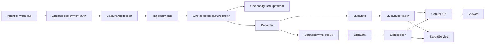

# Inference Capture simplification: one mode, no leases

Date: 2026-09-19

Status: proposed implementation handoff

## Decision

An inference-capture process serves exactly one upstream and runs in exactly
one capture mode for its entire lifetime:

- **text mode** proxies an OpenAI-compatible text-in/text-out API and captures
  the request and response around it; or
- **TITO mode** talks to a token-in/token-out inference server and preserves
  exact prompt and sampled token IDs using the tokenizer configured at startup.

The mode is a property of the process, not a trajectory and not a request. The
composition root selects one proxy implementation at startup. The other proxy
and its supporting services are not constructed.

Core inference-capture does not authenticate ingress traffic. A trajectory ID
in the route correlates an inference request with capture state; it is not a
secret or an authentication credential. Deployments that need authentication
must provide it outside the capture core, for example with an authenticating
reverse proxy, service-mesh identity, network policy, or optional ASGI
middleware.

The credential used by inference-capture to call its upstream is separate. It
is loaded once from process configuration, normally `UPSTREAM_API_KEY`, kept in
memory, substituted on outbound requests, and never persisted.

Delete the lease system. Keep trajectory lifecycle.

Keep the existing persistence direction: one in-memory live projection, one
append-only disk record, and narrow sink and reader boundaries. Do not add
SQLite. A PostgreSQL sink and reader may be added later without changing the
capture implementations.

## Simplifying assumptions

These are product constraints. The implementation should make them obvious.

1. One process has one upstream configuration.
2. One process is either text or TITO, never both.
3. The mode cannot change while the process is running.
4. Every inference route contains the trajectory ID used for attribution.
5. A trajectory ID is correlation data, not authorization.
6. The capture core has no per-trajectory ingress credential.
7. Upstream authentication is process configuration, not trajectory state.
8. One process owns and mutates its live trajectories.
9. Disk is the only persistence implementation required now.
10. Text and TITO share recording, state, reading, exporting, and viewing; they
    do not share request transformation merely for the sake of reuse.

The current code already implements parts of this model: upstream configuration
is fixed at startup, `UPSTREAM_API_KEY` is held in memory, and `upstream.mode`
is process-wide. It does not follow the model through the request path: it
constructs both proxies, stores a mode and credential in each trajectory,
resolves a lease on every request, and selects a proxy from that lease.

## Product contract to preserve

### Text capture

- Accept the OpenAI-compatible route shape expected by ordinary clients.
- Forward request and streaming-response behavior without semantic changes.
- Capture allowed headers, raw request and response bodies, chunks and timing,
  status, usage, and parsed conversation structure.
- Never persist inbound or upstream credentials.
- Replace any inbound authorization header with the configured upstream
  credential before forwarding.
- Keep recording failures from changing a successful upstream response, while
  exposing capture loss in state and health.

### TITO capture

- Render the request with the one tokenizer configured at startup.
- Send exact prompt token IDs to the inference engine.
- Store exact sampled token IDs returned by it.
- Attribute token ranges to messages and distinguish model-authored tokens from
  client-replayed tokens.
- Preserve branches when client history diverges.
- Serialize turns within one trajectory where the next exact prompt depends on
  the previous completion.
- Poison a trajectory after an attribution or token-consistency failure so no
  later turn can silently build on untrusted state.
- Keep disk I/O off the response's critical I/O path.

### Trajectory lifecycle

- A caller creates a trajectory before directing inference traffic to its
  route.
- The trajectory ID is the route correlation key and TITO session key.
- `created` and `active` trajectories accept inference requests.
- `finalizing`, `finished`, `aborted`, `expired`, and `poisoned` trajectories do
  not accept new requests.
- Finishing closes the route before waiting for already accepted turns.
- Finish records outcome metadata and waits for accepted capture to settle and
  become durable.
- A timeout may expire an abandoned trajectory. This is a trajectory timeout,
  not a lease expiry.
- Existing reward, labels, annotations, run/task/step identity, export, and
  deletion behavior remain supported.

### Storage and viewing

- Both modes use the same event schema, `Recorder`, `LiveState`, sink
  boundary, readers, export service, and control API.
- Finished and in-progress trajectories remain visible through the same `/v1`
  API.
- The browser talks HTTP and never parses record segments directly.
- The live viewer reads the in-memory projection and updates incrementally.
- An offline viewer replays disk records through the same reducer.
- A future database implementation plugs in at the sink and reader boundaries,
  not into either proxy.

## Non-goals

- Per-trajectory authentication or authorization in capture core.
- Treating a trajectory ID as an unguessable bearer secret.
- Supporting text and TITO traffic in one running process.
- Selecting capture mode from the request, route, or trajectory.
- Dynamic upstream registration, target CRUD, or changing targets at runtime.
- Forwarding an ingress credential to the upstream.
- SQLite or a generic SQL abstraction.
- A repository interface around every in-memory dictionary.
- Multi-writer coordination over one live trajectory.
- Direct filesystem access from the browser.
- Replacing exact TITO behavior with best-effort text reconstruction.
- Preserving compatibility for the generated trajectory `api_key`; its removal
  is an intentional API break.

## Separate the concerns currently called a lease

The current lease combines unrelated concerns:

| Concern | New owner |
| --- | --- |
| Which trajectory receives a request | `trajectory_id` in the route |
| Whether it may still receive requests | trajectory lifecycle status |
| Whether the caller may reach the service | deployment ingress policy |
| Which capture implementation handles it | process startup configuration |
| How capture authenticates upstream | in-memory upstream configuration |

Once separated, no lease object remains.

The security boundary must be described accurately:

```text
agent/workload -> optional deployment auth -> inference-capture -> upstream auth -> inference server
```

Core capture owns only the final arrow's credential. It may receive arbitrary
authorization headers from an OpenAI client, but it must strip them and never
record them. The configured upstream credential is then applied in memory.

Some OpenAI SDKs require a non-empty API key even when a local endpoint does
not authenticate it. A caller may use a documented placeholder such as
`unused`, or a deployment-provided ingress credential. Capture must not issue a
fresh secret and must not interpret that value as a trajectory lease.

## Target architecture



`Proxy` is either `TextProxy` or `TitoProxy`. It is never a dispatcher holding
both.

The trajectory gate performs only shared HTTP work:

1. parse the trajectory ID and upstream suffix from the path;
2. find the trajectory in live state;
3. reject unknown, deleted, or non-accepting trajectories;
4. read the request body within the configured limit; and
5. delegate to the one proxy selected at startup.

It does not read authorization headers, hash credentials, inspect a mode, or
choose between proxies.

## Target request path

The target shape is intentionally boring:

```python
class DataPlane:
    def __init__(self, *, trajectories, proxy, max_request_bytes):
        self._trajectories = trajectories
        self._proxy = proxy
        self._max_request_bytes = max_request_bytes

    async def __call__(self, scope, receive, send):
        trajectory_id, suffix = parse_capture_path(scope["path"])
        context = self._trajectories.resolve(trajectory_id)

        if context is None:
            return await send_error(send, 404, "unknown trajectory")
        if not context.accepting:
            return await send_error(send, 410, "trajectory is no longer accepting requests")

        body, too_large = await read_body(receive, self._max_request_bytes)
        if too_large:
            return await send_error(send, 413, "request body is too large")

        await self._proxy.handle(
            context=context,
            scope=scope,
            suffix=suffix,
            body=body,
            send=send,
        )
```

The lookup is synchronous and in-memory. It may return a small immutable
`CaptureContext`, or a copied trajectory view directly. Do not replace
`LeaseRecord` with an identical object under a different name. The request path
needs only fields it consumes, such as trajectory ID, project, body-capture
policy, and status.

Lifecycle correctness does not require a lease. Once a request passes the gate,
the recorder marks its turn open. Finish first changes the trajectory to a
non-accepting state, then waits for already open turns. A request accepted just
before finish may land; one arriving afterward receives `410`.

## Startup selects the implementation once

Mode selection belongs only in the composition root:

```python
if config.mode == "tito":
    sessions = TokenSessionManager(...)
    proxy = TitoProxy(
        engine=TokenEngine(transport),
        sessions=sessions,
        recorder=recorder,
        upstream=config.tito,
    )
else:
    proxy = TextProxy(
        transport=transport,
        recorder=recorder,
        upstream=config.text,
    )

data_plane = DataPlane(
    trajectories=TrajectoryGate(state),
    proxy=proxy,
    max_request_bytes=config.proxy.max_request_bytes,
)
```

The shared proxy boundary should contain only the `handle` operation the data
plane calls. Mode-specific resources should be owned by the selected
implementation where practical. Text mode must not construct a tokenizer,
token engine, token sessions, stored token traces, token decoding state, or
token-specific monitoring. TITO mode must not construct `TextProxy` as a
fallback; unsupported endpoints receive a clear error.

## Configuration and provenance

Prefer configurations that express the two valid states instead of one wide
configuration with fields meaningful only sometimes:

```python
@dataclass(frozen=True)
class TextUpstream:
    url: str
    api_key: str | None
    model: str | None


@dataclass(frozen=True)
class TitoUpstream:
    url: str
    api_key: str | None
    tokenizer: str
    model: str | None
    max_model_len: int | None
```

Validation happens at startup. Text does not require or load a tokenizer; TITO
requires one. There must be one authoritative mode answer and it must not be
inferred on each request.

The record manifest stores enough non-secret process-wide provenance to
interpret the record later: capture mode, protocol, model when known,
tokenizer identity for TITO, and rendering configuration affecting exact
output. It never stores the upstream API key.

Per-trajectory copies of process-wide upstream configuration should be removed
unless needed temporarily for old-record compatibility. They must never drive
request routing.

## Domain and state changes

Delete from `LiveState`:

- `leases`;
- `lease_by_trajectory`;
- `lease_for()`;
- `active_leases()`; and
- lease-specific deletion and replay behavior.

Delete `token_hash` from new trajectory events. Delete `LeaseRecord`, secret
generation, and token hashing if no unrelated feature uses them afterward.

Keep actual trajectory state: identity and grouping, lifecycle timestamps,
status, body policy, labels and annotations, graph and exchange counts,
capture-loss and late-call counts, and finish result. `expires_at` may remain as
the abandoned-trajectory deadline; rename comments and metrics accordingly.

Add one focused state read for the data plane, for example:

```python
def capture_context(self, trajectory_id: str) -> CaptureContext | None:
    ...
```

It returns a copy or immutable value. State continues to change only through
events.

Process mode must not participate in live dispatch. Whether it remains on each
trajectory as read-only provenance is a compatibility decision. Prefer mode in
the manifest for new records while allowing old readers to accept the legacy
field if required.

## Control API and SDK changes

The create response changes from a route plus generated credential to a route:

```json
{
  "id": "tr_...",
  "base_url": "http://capture/route/tr_.../v1",
  "expires_at": "...",
  "mode": "text"
}
```

Remove `api_key`. Returning mode is optional compatibility metadata, not a
routing instruction.

`CaptureCommands.create()` stops generating `trk_...` secrets, hashing them,
storing hashes in events, and describing the result as a lease.

Remove `api_key` from the SDK `Trajectory`. `Trajectory.env()` points the client
at the base URL without manufacturing a credential. Caller-owned ingress auth
remains under caller control. If an OpenAI client requires a local placeholder,
document it explicitly; never present it as security.

Finish remains a control operation. It closes the trajectory, releases any
TITO session, waits for open turns, records metadata, finalizes, and flushes.
Do not make text-mode commands depend on `TokenSessionManager`. Use a small
mode-specific close callback or put session cleanup under the selected TITO
component; do not introduce a lifecycle event bus.

## Upstream header rules

The proxy must:

1. remove credential-bearing headers from captured headers;
2. remove provider authentication headers from forwarded headers;
3. apply safe forwarded headers;
4. inject the in-memory upstream credential; and
5. send the request.

Tests must prove that an arbitrary inbound credential is neither persisted nor
observed upstream, and that the configured upstream credential is observed
upstream but never persisted.

## Persistence and read paths

The storage simplification remains unchanged:

```text
TextProxy or TitoProxy
        -> Recorder.submit(event)
        -> LiveState.apply(event)
        -> bounded queue
        -> DiskSink.append(events)
```

```text
live service:     LiveStateReader -> control API -> viewer/export
offline record:  DiskReader      -> control API -> viewer/export
future database: PostgresReader  -> control API -> viewer/export
```

The record remains portable:

```text
record/
├── manifest.json
├── events/
│   ├── segment-000001.capture
│   └── segment-000002.capture
└── snapshots/
    └── tr_....json.zst       # optional later compaction
```

The manifest owns process-wide mode and non-secret upstream provenance. Event
segments own trajectory facts. Snapshots are optional and derivable.

## Runtime ownership

`Runtime` remains the final composition and lifecycle root and is never
injected into a child. Its capture-side ownership should resemble:

```python
Runtime(
    config=config,
    state=state,
    recorder=recorder,
    reader=reader,
    transport=transport,
    proxy=selected_proxy,
    data_plane=data_plane,
    commands=commands,
    control=control,
    exports=exports,
)
```

It no longer exposes both text and token proxies, a lease registry, or token
services that do not exist in text mode. Avoid a runtime full of optional
fields that are `None` in half of deployments. Token-specific tasks run only in
TITO mode.

## File-level implementation map

### Delete

- `src/skyrl_capture/proxy/leases.py`
- lease-only tests after lifecycle assertions move to trajectory tests
- credential helpers in `secrets.py` if no remaining caller uses them

### Rewrite

- `proxy/app.py`: inject one proxy, resolve by trajectory ID, remove bearer
  parsing, lease fallback, and mode selection.
- `runtime.py`: choose once, construct only mode-relevant resources, remove
  `LeaseRegistry` and dual proxy ownership.
- `domain/state.py`: remove lease indexes and reads; add a minimal capture read.
- `domain/events.py`: remove token hashes and update lifecycle terminology.
- `domain/models.py`: delete `LeaseRecord` and remove the created `api_key`.
- `control/commands.py`: stop issuing credentials and decouple text mode from
  token sessions.
- `control/models.py` and `control/app.py`: update response shape and docs.
- `sdk.py`: remove lease/generated-key concepts and update environment setup.
- `config.py`: express the two startup configurations and keep secrets private.
- `control/health.py`: report the selected proxy, not text, tokens, and leases.
- delete `control/decoder.py`: TITO stores text and offsets at capture time.

### Audit

- `upstream/`: retain abstractions required by supported text and TITO servers;
  guarantee inbound-auth stripping and outbound-auth injection; determine
  whether the generic plugin registry still earns its complexity.
- `tokens/`: keep exact-token behavior, remove text fallback, and own session
  cleanup in the TITO path.
- `proxy/text.py`: consume the minimal trajectory context instead of a lease.
- persistence codecs and goldens: read the old event shape only if compatibility
  is required; never reconstruct an old credential.
- CLI and docs: describe one process mode and separate ingress from upstream
  authentication.

## Implementation sequence

### Phase 1: Pin the contract

Tests establish that one runtime constructs only its selected mode, trajectory
creation returns no key, active routes need no core auth, terminal routes return
`410`, unknown routes return `404`, inbound auth is stripped, upstream auth is
memory-only, and mode cannot vary by trajectory.

Add architecture checks forbidding `LeaseRegistry`, `LeaseRecord`,
`lookup_cached`, `token_hash`, and generated trajectory credentials.

### Phase 2: Remove leases

Change create responses and SDK handling, replace the data-plane lookup with a
trajectory-ID lookup, then remove lease state, models, events, metrics, and the
module. Recovery no longer restores credentials. Status gating preserves
close-after-finish behavior.

### Phase 3: Make construction exclusive

Move the single mode branch into `build_runtime()`. Inject one proxy into the
data plane. Move token-only services into the TITO branch and remove text
fallback. Object-graph tests prove unused components are absent, not merely
idle.

### Phase 4: Simplify configuration and provenance

Make valid upstream variants explicit, move process-wide non-secret provenance
to the manifest, remove request-path reads of per-trajectory mode/upstream
snapshots, and reject incompatible record reuse at startup.

### Phase 5: Collapse lifecycle edges

Remove text-mode dependencies on token sessions and monitoring. Remove the
read-time decoder entirely: TITO nodes carry their presentation alongside the
exact IDs.
Place TITO cleanup and tasks under the selected TITO component. Simplify health
around one proxy.

### Phase 6: Delete debris

Search production code, tests, docs, and fixtures for:

```text
LeaseRegistry
LeaseRecord
lookup_cached
lease_for
active_leases
lease_by_trajectory
token_hash
api_key              # trajectory response/SDK uses, not upstream config
lease-expiry
lease credential
```

No remaining occurrence of “lease” should describe a trajectory or route.

## Required tests

### Construction

- Text runtime contains no token engine, renderer, sessions, traces, or token
  loop task.
- TITO runtime contains no `TextProxy`.
- `DataPlane` receives one handler.
- No child receives `Runtime`; construction needs no mutation.

### Request path

- An active trajectory reaches the selected proxy with no auth header.
- Unknown trajectory returns `404` without contacting upstream.
- Finished, aborted, expired, and poisoned trajectories return `410`.
- Oversized bodies return `413` before upstream contact.
- TITO rejects unsupported endpoints instead of falling back to text.

### Credentials

- Inbound authorization is absent from capture and from the upstream request.
- Configured upstream authorization reaches upstream and appears nowhere in
  events, state, disk, exports, API responses, errors, or logs.
- Unique arbitrary ingress keys cannot grow a cache because no cache exists.

### Lifecycle races

- A request accepted before finish may commit and is included.
- A request after finish begins receives `410`.
- Finish waits only for open turns and remains bounded.
- A late commit is marked late rather than reopening the trajectory.
- TITO session state is released on close.
- Abandoned trajectory expiry works without a lease registry.

### Mode and persistence

- Text mode never loads a tokenizer, including viewer setup.
- TITO preserves exact prompt and sampled IDs.
- Text streaming remains byte-compatible with upstream.
- Live and replayed readers return equivalent views and exports.
- The manifest has enough provenance for offline token decoding.
- Old lease-bearing records are readable only if compatibility is intentional;
  no credential is reconstructed or returned.

## Compatibility and migration

Removing `api_key` from trajectory creation is intentionally breaking. Make the
break obvious rather than returning a dummy generated secret that callers may
mistake for protection.

Recommended transition:

1. update server and Python SDK together;
2. update examples to configure the route plus caller-owned ingress policy;
3. document deployment authentication separately;
4. bump the schema version for lease-free `TrajectoryCreated`;
5. ignore old token hashes when reading old records if compatibility is
   required; and
6. never expose a historical hash or try to derive its credential.

If old-record compatibility is not yet promised, delete the legacy codec path
and regenerate fixtures. Make that decision once rather than leaving a hidden
half-migration.

## Security consequence

Inference-capture itself will not prevent one reachable client from writing to
another known active trajectory. A trajectory ID is not a security boundary.
The service must not be presented as safe for untrusted public ingress without
external authentication and authorization.

That is simpler and more honest for the intended trainer-controlled sidecar or
local-service deployment. It lets each deployment choose identity appropriate
to its environment instead of coupling capture records to one auth scheme.

## Expected simplification

A request no longer carries two competing identities—the route trajectory and
the trajectory bound to a credential—and no longer rediscovers a process-wide
mode. There is no cache coherency protocol, negative credential cache,
credential recovery, or unused capture stack.

```text
startup: choose TextProxy or TitoProxy
request: trajectory_id -> active trajectory -> selected proxy
```

The remaining complexity corresponds to product value: exact TITO rendering
and attribution, faithful text/streaming behavior, trajectory graphs and
lifecycle, asynchronous durability, responsive reading, and deterministic
exports.

## Definition of done

1. One runtime constructs exactly one capture proxy.
2. No request or trajectory selects between text and TITO.
3. `DataPlane` has one handler dependency.
4. No per-trajectory ingress credential is generated, returned, hashed,
   persisted, recovered, cached, or validated.
5. No lease registry, record, state, or metric remains.
6. Routes correlate by trajectory ID and gate by trajectory status.
7. Upstream credentials exist only in memory and outbound transport.
8. Inbound credentials are stripped and never forwarded or captured.
9. Text mode constructs no token-only resources.
10. TITO mode constructs no text proxy or fallback path.
11. Finish, poison, expiry, late-call, and in-flight settling semantics pass
    without leases.
12. Both modes produce equivalent live and replayed views.
13. Disk records remain portable and the live viewer remains responsive.
14. Sink and reader boundaries remain suitable for future PostgreSQL support.
15. Runtime is only composition and lifecycle; no child receives it.
16. Documentation clearly separates route correlation, optional ingress auth,
    and upstream auth.

---

## Execution log

### One mode, no leases (2026-09-19)

Done in one pass, in the order the plan lists: contract, leases, exclusive
construction, configuration, lifecycle edges, debris.

**Leases.** `proxy/leases.py`, `secrets.py`, `LeaseRecord`, `secret_token()`,
`hash_token()`, `TrajectoryCreated.token_hash`, the create response's
`api_key`, the SDK `Trajectory.api_key`, and `LiveState.leases`,
`lease_by_trajectory`, `lease_for()`, `active_leases()` and `_revoke_lease()`
are all gone. `DataPlane` resolves one `CaptureContext` -- trajectory id,
project, status, bodies, overrides -- from the live state by the id in the
route, and gates on it: `404` unknown, `410` closed. There is no cache, so
there is no invalidation, no negative cache and no revision check to get wrong.

**Exclusive construction.** `build_runtime` branches once on
`TextUpstream` or `TitoUpstream`. A text runtime has no session manager, no
token engine, no trace source, no loop-lag task and imports no renderer --
asserted by watching `sys.modules`, not by reading fields. A token runtime has
no `TextProxy`, and refuses an endpoint it cannot render rather than falling
back. Each proxy owns its wire's error shape, so the data plane's `404`/`410`/
`413` arrive in the shape that route's clients parse without the data plane
knowing which upstream is configured.

**Configuration.** `UpstreamConfig` became the two variants the plan sketches,
so a tokenizer is required exactly where it is used. Which variant a process
holds *is* its mode. `provenance()` puts non-secret process-wide provenance in
the record's manifest. Health reports `mode` plus the selected proxy's counters
under `capture`, rather than a block per mode with half of them always zero.
`CaptureCommands` takes an `on_close` callback instead of the
`TokenSessionManager` text mode would construct in order to ignore.

**Where the plan and the code differ, and why.** The public mode value stays
`"tokens"` rather than becoming `"tito"`: it is on every trajectory, every
export row and every record, and renaming it would be an unrelated break.
`upstream_snapshot` stays on the trajectory as read-only provenance, which the
plan permits -- what matters is that nothing on the request path reads it, and
an architecture check now forbids any branch on a trajectory's mode.

**The `late` flag changed meaning.** It used to mean "a proxy acted on a stale
cached lease". With the gate reading live status there is no stale view to act
on, so it now marks the microsecond race where a request passes the gate and
finish lands before the request's own clock is read. Marked, never refused, and
it does not reopen the trajectory.

Architecture checks forbid `LeaseRegistry`, `LeaseRecord`, `lookup_cached`,
`lease_for`, `active_leases`, `lease_by_trajectory`, `token_hash`,
`secret_token`, `hash_token`, `UpstreamConfig` and any `trajectory.mode ==`
branch. No occurrence of "lease" describes a trajectory or a route anywhere in
the source, the tests or the documentation.

412 tests, 6 skipped; the viewer's 36 unchanged. The goldens moved in one way:
the upstream block gained `mode` and lost the null tokenizer.

### One text-protocol adapter, and no per-trajectory overrides (2026-09-20)

Two changes with one shape: the last two places where provider knowledge and
upstream configuration leaked out of where they belong.

**All provider knowledge is behind one adapter.** `TextProtocol` is the whole
contract -- name, client suffix, client environment, upstream URL, auth
headers, error body, endpoint kind, and `extract()`. `upstream/openai.py` and
`upstream/anthropic.py` are the two implementations, `upstream/text.py` holds
the contract and the OpenAI-shaped base, and `upstream/registry.py` maps a
name to one. Token engines moved to their own contract and registry in
`tito/upstream.py`. Gone: `WireFormat`, `BaseWireFormat`, `BaseUpstreamServer`,
the `servers.py`/`wire.py` split, `capture/parse.py`'s central dispatch, every
`endpoint_kind == "messages"` branch, and the per-exchange
provider-registry lookup -- the adapter is resolved once at
startup and handed to the proxy and the commit path.

**The proxy stayed byte-transparent.** Nothing on the forward path asks the
adapter about the body. It reads already-forwarded bytes afterwards, where a
failure is a recorded derivation error that cannot reach a client, which is
also why the adapters read JSON shallowly rather than validating against a
provider SDK's models: a model that rejects an unknown field would turn a
compatible request into a failed one.

**Identity stayed in the domain.** An adapter returns its provider's own
messages -- `ExtractedMessage`/`ExtractedExchange` in `domain/extraction.py` --
and normalizing, hashing and counting are applied there, the same way for every
provider. A contributed adapter cannot get message identity subtly wrong, and a
graph built from one provider means what a graph built from another means. An
adapter that materializes a message out of something that was not one
(Anthropic's `system`, Responses' `instructions`) says so in `derivation`,
which travels onto the node as evidence.

**Per-trajectory overrides are gone** from the create API, the SDK,
`TrajectoryCreated`, `LiveState`, `CaptureContext`, `TextProxy`, `TitoProxy`
and the token engine's payload construction. The replacement rule: deployment
and upstream settings come from process configuration; authentication comes
from process configuration; per-inference sampling and behaviour come from the
inference request; a trajectory carries capture metadata. `CaptureContext` is
now exactly `(trajectory_id, project, status, bodies)`, asserted by a test that
reads its fields. `RECORD_FORMAT_VERSION` is 4.

**The mode is stated rather than inferred.** Reading the environment used to
ask the registry which kind a name was, which resolved a name before
`--upstream-module` had been imported -- a contributed engine would have been
classified as whatever was registered at that moment. `CAPTURE_MODE` (and
`--mode`) now picks the variant, `UPSTREAM_TYPE` is recorded as a name, and the
name is resolved once, in that mode's registry, at startup.

**One consequence worth stating.** A trajectory's `protocol` is what a *client*
speaks to that route, so a token-capture route reports `openai`: a caller sends
it OpenAI chat completions whatever engine wire capture uses behind it. The
engine's own type stays on the upstream snapshot. That is the only golden
change -- the upstream block gained `protocol`.

Architecture checks forbid `WireFormat`, `BaseUpstreamServer`, `UpstreamServer`,
`parse_exchange`, `capture.parse`, `.wire`, the `token_request`/`token_response`/
`token_url` spellings, `endpoint_kind == "messages"`, per-exchange registry lookups,
and any per-trajectory `overrides`.

423 tests, 6 skipped; the viewer's 36 unchanged.

### Packages state the architecture (2026-09-20)

The final package names describe boundaries rather than implementation
materials. `data_plane/` is the shared inbound ASGI boundary and delegates to
exactly one process mode: `text/` or `tito/`. Shared HTTP mechanics live in
`transport/`; neither mode owns them. The resulting observation crosses
`writer/`, while control and export queries cross `reader/`. The lower-volume
API is explicitly `control_plane/`, paired with `data_plane/`.

`domain/` and `persistence/` remain between those sides rather than belonging
to either one. The domain defines events and the live projection; persistence
defines the replaceable sink and record format. This leaves the dependency
shape visible from an import alone and removes the ambiguous `proxy/`,
`tokens/`, `core/`, `read/`, and `control/` package names.

### TITO captures its readable token representation (2026-09-20)

Every TITO node now commits exact token IDs together with the decoded text and
verified per-token character offsets produced by the same renderer. A renderer
whose individual token pieces do not reconstruct the span is rejected during
commit. Readers only assemble this captured representation; they never load a
tokenizer or reinterpret IDs.

Consequently `control_plane/decoder.py`, the runtime decoder field, the record
viewer's tokenizer override, the read-time fallback in `path_views`, and the
`/paths.decoder` status field are gone. Live and record views now return the
same document without an allowed decoder-status drift.
