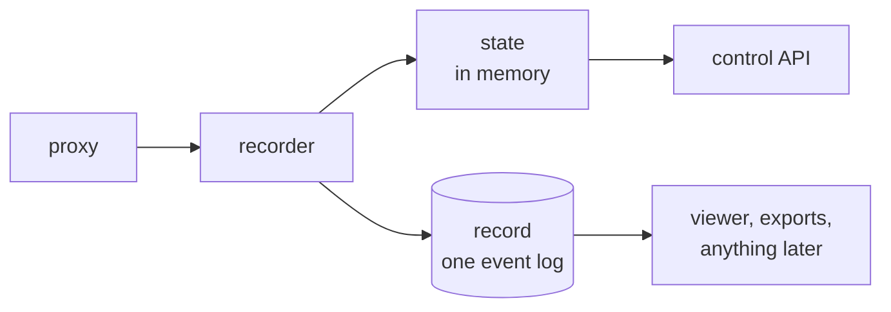

# The store

Capture holds its state in memory and writes its results to a record
directory. There is no database.

This note records why, and what had to be answered to get there. It replaces
the 2026-09-17 version, which asked whether the database was needed and
answered "not now, and not blind".

## What decided it

The earlier note framed this as "is capture one pod, or several?" -- and that
turned out to be the wrong question, because the answer does not change the
design.

**Every trajectory already has exactly one writer, and a database is not what
makes that true.** Consistent hashing is: with more than one replica the load
balancer must hash on the trajectory id, which `operations.md` has required all
along, because text mode derives the graph by reading and writing back and
token mode holds the rendered tokens on the replica that served the last turn.
One replica or ten, a trajectory is owned by one process.

Which makes the four transactional mechanisms in the old design guards against
contention that does not exist:

| Use | Guarded against | What is actually true |
| --- | --- | --- |
| Exchange, nodes and counters land together | a torn write | One owner appending in one process has nothing to tear |
| The same exchange arriving twice is absorbed | a concurrent writer | A trajectory has exactly one owner; this only ever covered restart replay |
| An export job is claimed once | a race between pollers | One runner per process |
| A trajectory and its lease are one fact | a torn write | A single-owner map is indivisible for free |

The measurement that was supposed to decide it turned out not to matter, which
is worth saying plainly: the store never appeared in a turn's profile. Per
turn, capture spends ~254 ms waiting on the engine and ~0.8 ms finding the
trajectory. **Transactions were never the cost.** The case for this change is
that a database is a large thing to operate for a job that lives as long as one
training run -- not that it was slow.

## What it removes

PostgreSQL, the embedded PostgreSQL that downloads and unpacks a server binary
on first start, the binary cache, the migrations, `asyncpg`, and about fifteen
seconds of startup. For a process that exists for the length of one run, that
was most of the operational surface.

## The shape

**State is memory; the record is the result.** The live state answers the
control API while a run is in flight, and it is a projection of the log --
built by applying the same events a reader replays. This makes the thing that
was already the portable artifact also the thing that is durable, and leaves
one implementation of what an event means.

## The three questions the old note left open

### Crash recovery

**Answered by the log, and better than the question assumed.** Every event goes
to the record as it is applied, so a restarted process replays the record
directory and continues it: finished trajectories are readable, one that was in
flight continues if its caller still holds the lease, and an abandoned one is
expired by the sweep.

What is lost is the events applied and not yet durable -- one fsync window,
reported live as `capture_recorder_lag_events`. That is the honest trade
against what a database bought, and it is a bounded number rather than "the
trajectories that were open".

The earlier version of this note said an in-flight trajectory could not survive
and that spool replay was a design waiting to be proved. Making the log the
record rather than a queue in front of one is what proved it: the replay path
is the same reducer the live process uses, so "replay is equivalent to the
write" is true by construction rather than by argument.

### Writing cannot be child processes

**Found by running it.** Ingestion workers were *spawned*, so a child built its
own state and wrote into a map the parent could not see -- the proxy counted
accepted exchanges, the children ingested them, and the trajectory sat in
`finalizing` for ever with nothing written.

There are no workers now: the serving process derives each exchange after its
response has gone out and submits it. So the ceiling is one core's worth of
parsing and graph-building, shared with the proxy's GIL. A capture that
outgrows it needs a second pod per inference server.

Measured: one pod, 8 concurrent trials, 2250 model calls in 93 s, nothing
dropped. The ceiling is real but it is not close.

### Export while capturing

Exports run off a snapshot of the state, taken under the same single-owner rule
that makes everything else indivisible: one process, one writer, so a copy
taken between turns is consistent by construction. No locking, because there is
nothing to lock against.

### What multi-replica becomes

**It keeps working, and the routing rule that already exists is why.**

Running several replicas has always required the load balancer to hash on the
trajectory id -- `operations.md` states it, and both modes need it: text mode
derives the graph by reading and writing back, and token mode holds a
trajectory's rendered tokens on the replica that served its last turn. So
**every replica already owns a disjoint set of trajectories.** A shared
database was never what made the write path safe; sticky routing was.

Which means in-memory state is per-replica state, and the write path needs
nothing shared. What a shared store was actually buying, given routing, is
narrower than it looks:

| | Who provides it now |
| --- | --- |
| One writer per trajectory | Consistent hashing, as before |
| The result outliving the process | The record directory, one per replica |
| A listing or export spanning replicas | **Nothing, while trajectories are in flight** |
| State surviving a change of owner | **Nothing** |

The last two are the honest cost, and they are worth stating precisely rather
than dismissing.

**Cross-replica reads.** A run's trajectories are spread across replicas, and
each replica can only answer for its own. Each replica's record is readable by
anything afterwards, with no database -- that is what `reader/disk.py` does, by
replaying the log. What is not available is a listing across the fleet without
fanning the query out to every replica, or opening every record.

**Two details consistent hashing forces.** Neither is hard; both are easy to
get silently wrong.

1. *A trajectory must be created on the replica its id routes to.* The id does
   not exist before creation, so `POST /v1/trajectories` cannot be hashed on
   it -- and if the creating replica is not the one the id hashes to, the first
   turn arrives somewhere with no state for it. The fix is for a replica to
   mint ids that hash to itself, which needs it to know the ring.
2. *Ownership must not move mid-run.* Adding or removing a replica reshards,
   and an in-flight trajectory whose owner changed has no state on its new
   owner. Previously the database let the new owner rebuild it. Now it cannot,
   so reshard between runs, or accept that the trajectories open at that moment
   are retried.

Capturing several inference servers is still several processes, one each. That
was always true and is unaffected.

## Adding durability back later

**This is expected, not hypothetical.** The first version has no database
because durability is not what it is for yet. What comes later is a choice
between shapes, and the point of the design is that all of them stay open:

| Shape | What it is |
| --- | --- |
| disk | the record directory, which is what ships |
| disk + blob | the record, with payloads in object storage |
| blob | both in object storage, nothing local |
| + a database | an index over the above, for reading |

**A database is not ruled out, and reading is the reason it would come back.**
Listing a run, filtering by step, aggregating across a sweep -- those are
queries, and a directory scan is a poor substitute at scale. That is a real
argument and a different one from durability.

What matters is where it goes: **as a sink, not as the live store.**

State stays in memory and stays authoritative. A database, if one is ever
wanted, is written to -- a projection of what the process already decided, the
way the record directory is today. That keeps one live implementation, and the
thing being persisted is a result rather than a step.

What to avoid is a database *behind* the store, selected by a flag. Then every
operation has two implementations that must agree, and the ways they disagree
are exactly the ways this system is fragile: ordering, idempotency, what a
partial write leaves behind. Two backends are each correct only where they are
tested, and the store is not where that risk is worth taking.

The cheapest durability, and the one already built, is the record: every event
is appended as it is applied, and a restart replays it.

So the order to reach for, if this is ever outgrown: object storage under the
record first, because it changes nothing above the sink; then an index over it,
when reading is what hurts; and only then a database in the write path, if
something ever genuinely needs one there -- which nothing yet does.
