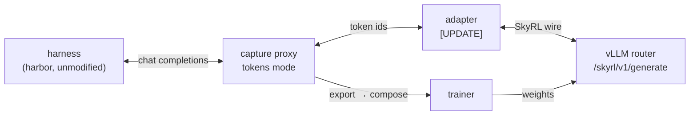

# SkyRL integration

Design note. The capture side is built; the SkyRL side is a worked example in
that repo under `examples/train_integrations/harbor/skyrl-capture/`.

> **[UPDATE] 2026-09-15 — first end-to-end run.** Harbor ran against this path
> for real: Qwen3-30B-A3B-Thinking-2507, two vLLM engines behind the
> vllm-router, Modal sandboxes, 4 trajectories on CodeContests, compared
> against SkyRL's proven `collect_rollout_details` integration. The headline
> held — **the two renderers produce token-identical prompts** — and a dozen
> claims in this note needed correcting, four of them bugs in code this note
> calls *built*. A further five things it asserts are simply untested, and are
> marked as such rather than left to read as results. Every `[UPDATE]` below is
> from that run. The harness is `SkyRL/../work_icap`; the capture-side fixes
> are in this repo's working tree, unstaged.

An RL harness runs unmodified, in text space, and training gets the exact
tokens. The harness keeps no token bookkeeping, and the same path works for any
harness that speaks OpenAI Chat Completions.



## Two hooks

**Inference setup**, once per run, beside the router:

```python
from skyrl_capture.service import CaptureService

service = CaptureService(
    num_workers=4,
    data_dir=config.inference.proxy.data_dir,
    port=config.inference.proxy.port,
)
# ... bring up the vLLM router ...
service.start()                                    # returns once /healthz answers
asyncio.run(service.ensure_target(
    name="policy", type="tokens", url=f"{router_url}/generate",
    model=model_name, tokenizer=tokenizer_name,
    config={"max_model_len": max_seq_len},
))
```

> **[UPDATE, superseded] This hook could not run in SkyRL's process.** Our
> `tokens` extra pinned `transformers>=4.50,<5`, said to be because the pinned
> `renderers` revision imports a 4.x path that 5.x removed. SkyRL pins
> `transformers>=5.6.1,<=5.16.1`, so the two could not be installed together.
>
> **The pin was wrong.** Every symbol `renderers` imports still resolves on
> 5.16.1, and the two versions render byte-identically. The cap is lifted, one
> environment holds both, and `CaptureService` now runs in the trainer process —
> verified end to end: service up, a `skyrl` target ensured, a trajectory
> created, finished and torn down, all in SkyRL's own venv.
>
> That surfaced one more bug: `CaptureService(port=...)` moved the bind port but
> not `proxy.public_url`, so every trajectory came back pointing at :8080
> whatever the service was listening on. Fixed, with the explicit `PUBLIC_URL`
> case left alone because behind a load balancer it is deliberately not the bind
> address.
>
> What works instead is the service path this note already calls equivalent:
> run `skyrl-capture serve` in its own environment, and install only capture's **base**
> package (httpx, orjson — no transformers, no renderer) in SkyRL's. The
> generator does not notice; `create_trajectory` is an HTTP call either way.
> Out-of-process is therefore the *default* for SkyRL, not an alternative, until
> the renderer pin and SkyRL's converge.

> **[UPDATE] There is no `{router_url}/generate`.** SkyRL serves
> `/skyrl/v1/generate` (and `/inference/v1/generate`), and the shape is not
> ours. It differs three ways, all load-bearing:
>
> | | capture sends/expects | SkyRL serves |
> | --- | --- | --- |
> | request | `{"prompt_token_ids": [[...]], ...}` — a batch of one | `{"token_ids": [...], ...}` — singular |
> | response | parallel `response_ids` / `response_logprobs` / `stop_reasons` | `{"choices": [{token_ids, finish_reason, logprobs: {content: [{logprob}]}}]}` |
> | session affinity | `session_id` in the body | the `X-Session-ID` **header** |
> | routed experts | nested lists covering prompt and completion | a base64-packed numpy blob |
>
> The session one is the quiet failure: hooked up naively the router still
> answers, and only prefix-cache locality is lost.
>
> SkyRL's *Python* interface (`InferenceEngineInput` / `InferenceEngineOutput`)
> **is** the batched shape we expect — it is simply never served over HTTP,
> which is most likely where this line came from. Until one side moves, a
> tokens target against SkyRL needs an adapter; the run used a ~60-line one
> (`work_icap/tito_shim.py`). **Open question for us: do we accept
> `choices[0]`-shaped responses in `tito/engine.py`, or does SkyRL serve the
> batched shape it already models?**

**The agent loop**, once per trial:

```python
from skyrl_capture.sdk import create_trajectory
from skyrl.skyrl_capture import compose

trajectory = create_trajectory(
    project=get_experiment_name(), target="policy",
    trajectory_id=session_id,                       # also the engine session key
    upstream={"body": {"cache_salt": cache_salt}},  # the policy version
)
try:
    harbor_config["agent"]["kwargs"]["api_base"] = trajectory.base_url
    harbor_config["agent"]["kwargs"]["api_key"] = trajectory.api_key
    await harbor.run(harbor_config)
finally:
    trajectory.finish(annotations={"reward": reward})

return compose(trajectory.export("token-samples"))
```

The harness is untouched. It gets a base URL and a key, which is all it ever
needed.

> **[UPDATE] Three corrections to this snippet.**
>
> 1. **`trajectory_id` must be unique for all time, and SkyRL's is not.** A
>    caller-supplied id names one trial permanently. SkyRL's `TrajectoryID` is
>    unique only *within* a step: instance 0, repetition 0 comes round every
>    step and on every re-run, and the second one dies on
>    `409 trajectory '0_1' already exists`. The name has to carry a per-run id
>    and the step. Aligning capture's session with SkyRL's still works — the
>    SkyRL id stays the last segment.
>
> 2. **`api_key` next to `api_base` is silently dropped by Terminus-2.** It
>    takes `api_base` as its own parameter, forwards `llm_kwargs` to the
>    LiteLLM constructor, and swallows everything else. The route then answers
>    `401 unknown or invalid trajectory credential` with nothing in the trial
>    config to explain it. The key belongs in
>    `agent.kwargs.llm_kwargs.api_key`. "It gets a base URL and a key" is true;
>    *where* the key goes is per-agent, and worth saying out loud.
>
> 3. **`compose` takes more than the rows.** Its real signature is
>    `compose(exports, *, trajectory_ids, rewards, stop_reasons, step_wise,
>    generation_times=None)` — one entry per trajectory, because the outcome
>    masks are the harness's to supply. The one-liner here understates it.

## What we add

| | What | Status |
| --- | --- | --- |
| `CaptureService` | Run the proxy from Python; `skyrl-capture serve` calls the same thing | built — **[UPDATE]** unusable in SkyRL's process; see above |
| `ensure_target` | Create or update, so a restarted bootstrap does not fail | built — **[UPDATE]** was in-process only; `PUT /v1/targets/{name}` added |
| `trajectory_id=` | Name the trajectory; it is also the engine's session key | built — **[UPDATE]** was unroutable; fixed |
| `upstream=` | Per-trajectory headers, and body fields for tokens targets — where `cache_salt` lives, because it is keyed on a weight version that moves every step | built — **[UPDATE]** not exercised; the run used `use_cache_salt=false` |
| `trajectory.export(...)` | One trajectory's rows, over the export `/v1` already runs | built — **[UPDATE]** never decompressed; fixed |
| Resident-trace read | Serve `export` without waiting for ingestion | not yet — **[UPDATE]** still not yet; the storage path served every export in the run |

> **[UPDATE] Four of these were "built" and did not work end to end.** All four
> are fixed in this repo's working tree, and all four were invisible to the
> test suite because nothing exercised the full path.
>
> * **A caller-named trajectory was unroutable.** `CaptureServer` dispatched to
>   the data plane only for paths starting `/tr_` — so a trajectory named `0_1`,
>   the entire point of `trajectory_id=`, was created, handed back a
>   working-looking base URL, and `404`d on every turn. The dispatcher now
>   treats any non-control path as a trajectory route, and a name colliding
>   with one (`v1`, `healthz`, `ui`, …) is refused at creation rather than
>   discovered as a 404 mid-rollout. *`server.py`, `control_plane/app.py`.*
>
> * **`Trajectory.export()` never decompressed.** Artifacts are stored zstd;
>   the CLI decodes on the way out (`encode_artifact`) and the SDK did not, so
>   every call failed with `str is not valid UTF-8: surrogates not allowed` —
>   the zstd magic number reaching the JSON parser. *`sdk.py`.*
>
> * **`Trajectory.finish()` dropped `annotations`.** The module-level
>   `finish_trajectory` accepts them and the server stores them; the
>   convenience method this note uses to attach the reward did not forward
>   them. *`sdk.py`.*
>
> * **`ensure_target` had no HTTP route.** It exists on `CaptureService`, and
>   from outside there was POST, GET and DELETE and nothing else — so a
>   bootstrap that ran twice had no way through, and the error told the caller
>   to use a method they could not reach. `DELETE` is not an escape either: a
>   deleted target is never resurrected, so one wrong bootstrap burns the name
>   permanently. `PUT /v1/targets/{name}` now calls `ensure_target`, keeping
>   the no-resurrection rule in the store. *`control_plane/app.py`,
>   `control_plane/models.py`.*

`export` returns one record per root-to-leaf branch, with node boundaries kept:

```
branches: [
  { node_ids, token_ids, sampled_mask, logprobs, routed_experts,
    node_spans: [(start, end), ...] }
]
```

plus the trajectory's labels, annotations, and per-turn stop reasons.

> **[UPDATE] `node_spans` exists as of 2026-09-18.** It did not when this was
> written, and for a while the sketch above described something the export did
> not emit: `node_ids` and a flat `loss_mask` with nothing mapping one to the
> other, so node boundaries lived only in the graph.
>
> A row now carries `node_spans` as `[[start, end], ...]`, parallel to
> `node_ids` and including an empty span for a node that contributed no tokens.
> The two claims that rested on it -- that a branch also encodes its turns, and
> that the train-once rule is checkable per node -- hold from an export alone.
>
> The full row is `{path_id, trajectory_id, node_ids, node_spans, abandoned,
> labels, annotations, trainable_count, input_ids, loss_mask,
> rollout_logprobs, rollout_expert_indices, stop_reason, tokenizer, model,
> tools, schema_version}`.

**A trace can yield several samples.** A linear rollout is one branch,
summarization is two, a sub-agent fan-out is more. One reward covers the whole
tree, so every branch carries the same annotations.

Two rules belong to us rather than the caller:

- **A sampled node reachable from several branches is trainable in exactly
  one.** Forks share their ancestor assistant nodes, and counting them per
  branch double-counts the same sampled tokens.
- **Rows are never dropped.** `trainable` carries every filtering decision, so
  `compose` can see what was excluded rather than inferring it from a missing
  row.

> **[UPDATE] The train-once rule is still untested.** Terminus-2 rewrites the
> assistant message on its *first* turn, so a Harbor trajectory forks before
> any sampled node is shared: all the two branches have in common is the
> 1035-token prompt, in which nothing is trainable. Every trajectory in the run
> branched, and not one of them exercised the rule.
>
> Testing it needs a fork *after* a shared completion — a summarizer, or a
> sub-agent fan-out. Until then this is an assertion, not a result. (With
> `node_spans` absent it also cannot be checked per node, only over the literal
> token prefix two branches share.)
>
> "Rows are never dropped" did hold: 8 branches from 4 trajectories, none
> missing.

Node boundaries mean a branch also encodes its turns — each contiguous sampled
span is one turn's completion, and the client nodes before it are that turn's
prompt delta. So `compose` produces per-branch or per-turn rows from the same
record and we need no mode flag, which matters because
`step_wise_trajectories` means per-turn rows in SkyRL's non-TITO path and
per-branch rows in its TITO composer. With it off, a trajectory yielding more
than one trainable branch is masked entirely — so a summarizing agent needs it
on.

> **[UPDATE] "A branch also encodes its turns" is not true of the export**, for
> the same reason as above — the turn boundaries are in the graph, not in the
> row. The run used per-branch rows and `step_wise=True` throughout, which
> worked; per-turn rows from the same record remain untested and, as the export
> stands, not derivable.

### Reading it without waiting for storage

The proxy holds the exact tokens the moment a turn commits, so durability does
not belong in the training loop. `export` serves from the resident trace and
falls back to the stored graph when a trace has been evicted — same rows, and
the fallback is what makes a crashed run recoverable.

The size of the difference: a step of 512 rollouts x 10 turns is 5,120
exchanges against roughly 255 a second, so about 20 seconds of ingestion after
the last rollout finishes, before any export job starts.

> **[UPDATE] Recoverability is real, and we used it.** After the run, the whole
> capture arm was re-exported and re-composed from storage alone — the graph
> plus the annotations written on `finish` — with no re-run of the agent
> (`work_icap/rebuild_icap.py`). That is this property being exercised rather
> than asserted, and it is also how a change to `compose` gets evaluated
> against a finished sampling round for free.
>
> The resident-trace read is still unbuilt, so every export in the run went
> through storage. At 4 trajectories the latency did not matter; the 20-second
> figure above remains unmeasured.

## Where the boundary is

`compose` lives in SkyRL. `GeneratorOutput` never appears in this repo.

The moment capture knows about `GeneratorOutput` it becomes a SkyRL component,
and the next harness needs the surgery this design exists to avoid. Their schema
also moves without a release here.

So `compose` owns the tensor layout and the masks only the harness knows — a
trial that timed out or errored, and overlong filtering. We owe it everything it
could need, in a stable shape, and nothing about how it is consumed.

> **[UPDATE] This boundary held, and is the part of the design that needed no
> change.** Every bug the run found sat on one side of it or the other; none
> was caused by the split, and none needed it moved. `compose` turned real
> exported rows into a `GeneratorOutput` with no field capture had to know
> about.

## Why not bookkeeping in the harness

SkyRL's non-TITO Harbor integration sets `collect_rollout_details=True` so
Harbor emits per-turn token IDs itself, and then has to ban summarization:
compaction breaks the accounting. That is the capability long-horizon agents
most need, disabled to keep the bookkeeping valid.

A proxy-side graph does not have the problem. A rewritten history stops matching
at the last unchanged message and branches there, which is what the graph is
for.

> **[UPDATE] Confirmed, and the effect is larger than "summarization".**
> Terminus-2 rewrites its history on *every* turn, with `enable_summarize=false`
> — it does not replay the assistant message it was given. Measured on the same
> 4 trajectories:
>
> * **capture:** every trajectory forked, 2 branches each, nothing lost.
> * **the baseline:** its per-turn rows do not compose into one conversation at
>   all. Turn 1's prompt re-uses only **1,035 of turn 0's 5,869 tokens**. Each
>   row is still individually exact, which is all step-wise training needs — but
>   there is no single sequence, and nothing in the rows says the history was
>   rewritten.
>
> So the argument does not depend on compaction being enabled. An ordinary
> ReAct agent with a thinking model already produces the case, because
> `reasoning_content` does not survive the round trip.

## Decided

- **Renderer agreement.** Pin the `renderers` commit SkyRL pins. Revisit if the
  two drift.
- **`reasoning_content`.** A Harbor setting, left to the user. Replaying the
  assistant message whole keeps prefix reuse; stripping it costs a full re-render
  per turn and forks the trajectory. Both are correct, and which one you want
  depends on the agent.
- **Throughput.** One proxy process holds about 75 turns a second, bound on
  rendering. It is the work SkyRL's proxy already does. Address it when it is
  the bottleneck; scale-out is a Ray actor group, and trajectory affinity falls
  out of the route.

> **[UPDATE] Renderer agreement: there is nothing to pin to, and they agree
> anyway.** SkyRL has no dependency on `renderers` — no reference to it
> anywhere in the tree. It renders through vLLM's Jinja chat template. So this
> was never a pin; it was two independent implementations, and the run
> measured them:
>
> **The prompts are token-identical** — all 1,035 tokens for one task and all
> 1,348 for the other, across 4 trajectories: system prompt, instruction,
> terminal state, generation scaffold. `prompt + completion` is the same
> sequence in both arms.
>
> One difference, and it is entirely about where the prompt ends:
>
> ```
> shared prefix (1035 tokens) … '\n'
>   SkyRL   : prompt ends '<think>' '\n'   completion starts 'Okay' ',' ' let'
>   capture : prompt ends                  completion starts '<think>' '\n' 'Okay'
> ```
>
> vLLM's Qwen3-Thinking template opens the thinking block *for* the model, so
> `<think>\n` is prompt and is not trained on. `renderers` does not, so the
> model emits `<think>` itself and we correctly mark it sampled. Both are
> exactly attributed and internally consistent — and they train two different
> things, by two tokens per assistant turn.
>
> **Open: which side moves.** Options are to render with the model's own
> template when one exists, to expose the generation-prefix choice on the
> target, or to declare our behaviour canonical and have SkyRL match. This is
> the one substantive disagreement the run found, and it is unresolved.

> **[UPDATE] `reasoning_content`: "left to the user" understates it.** With
> Terminus-2's defaults the assistant message never comes back whole, so the
> choice is not really offered: prefix reuse engaged on **0 of 8 turns**
> (`render_full: 8, render_bridged: 0`), and every trajectory forked. The cost
> is not hypothetical either — it is a full re-render per turn, growing with
> context, plus a branch per turn. Worth saying plainly that the common case
> for a thinking model is the expensive one, and worth a metric a caller can
> see (`render_bridged` is already there; nothing surfaces it per trajectory).

> **[UPDATE] Throughput: unmeasured here.** 8 turns total. The 75/s figure
> stands untested by this run.

## Not changing

The graph, the renderer, the fail-closed commit, and the export formats. This is
an API surface over `tokens` mode. The service path — `skyrl-capture serve`, replicas
behind a trajectory-affine load balancer — is the same runtime with a different
entry point.

> **[UPDATE] The fail-closed commit earned its place.** 8 turns, 0
> `commit_failures`, 0 `trajectories_poisoned` — and independently, decoding
> the stored tokens reproduces Harbor's own ATIF record of the same trial: the
> instruction it sent, the `reasoning_content` it got back, and the commands it
> then executed, none of which comes from us. Capture's logprobs also agree
> with the baseline's to the exact float on 422 of the 612 sampled tokens the
> two arms produced identically, which is what correct alignment looks like.
>
> The export formats did change, in one respect: see the `node_spans` update.

## [UPDATE] What this run leaves open

1. **The `<think>\n` boundary.** One renderer puts it in the prompt, the other
   in the completion. Decide which is canonical.
2. **`node_spans`.** Emit it, or drop the claims that rest on it.
3. ~~**The token wire.**~~ **Closed.** Neither: the wire belongs to the
   upstream kind. `type: "skyrl"` speaks SkyRL's shape natively and the adapter
   is deleted.
4. ~~**The `transformers` pin.**~~ **Closed.** The cap was unnecessary; lifted
   to `<6`, in-process `CaptureService` works, and `work_icap` runs on one
   environment.
5. **Train-once, unexercised.** Needs an agent that forks after a shared
   completion.
6. **Scale.** 4 trajectories, 8 turns, one task family, one model. Enough to
   find structural bugs; not enough for a rate.
